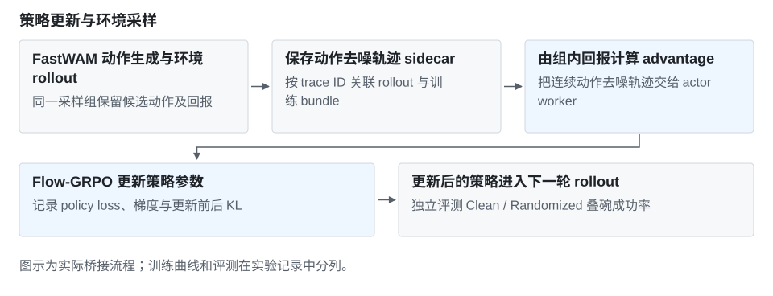

# FastWAM：Flow-GRPO 策略后训练

[首页](../../README.md) · [完整实验记录](experiments/flow-grpo.md)

将 Flow-GRPO 接到 FastWAM 的连续动作生成过程，在 RoboTwin 叠三碗任务上完成 40 次策略更新。历史评测汇总成功率由 **79% 提高到 83%**。

| 评测设置 | 初始策略 | 后训练策略 |
| --- | ---: | ---: |
| Randomized | 41/50 | **44/50** |
| Clean | 38/50 | **39/50** |

## 方法

实现 policy、rollout worker 与 actor worker 的桥接：采样端保存动作去噪轨迹 sidecar，训练端通过 trace ID 读取对应 bundle；按组内回报计算 advantage，再更新动作策略。

训练对象是连续动作的去噪路径，需要保存采样过程供 actor 重算，不能直接把动作当成语言 token。独立评测使用 Clean / Randomized 各 50 次，不用训练 reward 代替任务成功率。

## 失败原因

同一方法训练到 Update 30 时为 77/100，继续到 Update 40 回升至 83/100；中间退化原因未定位。原汇总使用估计计数字段，缺原始逐 episode 聚合，尚未验证多训练种子收益。

## 实验文件

[桥接方法与代码接口](experiments/flow-grpo.md#代码接口) · [训练曲线与各版评测](experiments/flow-grpo.md) · [评测 CSV](../../data/experiments/fastwam-evals.csv)
