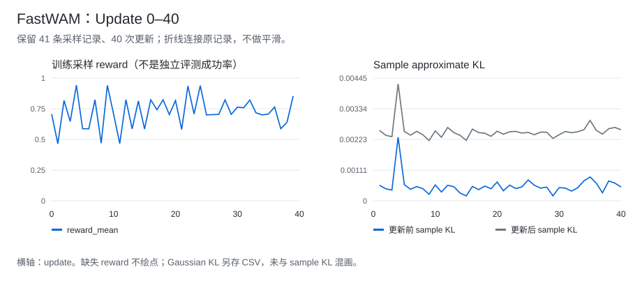

# Flow-GRPO：训练与评测记录

[项目介绍](../README.md)

将 FastWAM 的动作去噪轨迹接入 Flow-GRPO：rollout 保存 sidecar，actor 按轨迹标识读取训练 bundle，再用组内 reward advantage 更新策略。评测任务为 RoboTwin 的 `stack_bowls_three`。

[首页](../../../README.md) · [评测 CSV](../../../data/experiments/fastwam-evals.csv) · [更新指标](../../../data/experiments/fastwam-updates.csv) · [采样指标](../../../data/experiments/fastwam-rollouts.csv)

## Update 40 的评测

合计成功率 **79% → 83%，增加 4 个百分点**；Randomized 增加 6 个百分点，Clean 增加 2 个百分点。计数来自历史汇总的 `successes_est` 字段。

Randomized、Clean 各 50 次，2026 年 6 月。

| Checkpoint | Randomized | Clean | 两设置合计 |
| --- | ---: | ---: | ---: |
| Base | 41/50 | 38/50 | 79/100 |
| Update 30 | 40/50 | 37/50 | 77/100 |
| **Update 40** | **44/50** | **39/50** | **83/100** |

从 Base 到 Update 30，合计成功率下降 2 个百分点；Update 30 到 Update 40 回升 6 个百分点，最终比 Base 多成功 4 次。

计数来自汇总表的 `successes_est` 字段，缺少逐 episode 的 `aggregate.tsv`。100 次为两种设置的合计，非单一设置的配对评测；尚无重复训练种子结果。

## 训练过程

曲线对应 40 次更新和 41 条采样记录。最后一条 rollout（step 40）未生成候选，`candidates_done=0`，reward 留空。

| Update 40 指标 | 原记录值 |
| --- | ---: |
| Sample approximate KL，更新前 | 0.000497688 |
| Sample approximate KL，更新后 | 0.002576013 |
| Gaussian KL，更新前 | 2.521601648 |
| Gaussian KL，更新后 | 15.542404175 |
| Grad norm | 0.999203611 |
| Active rank count | 7 |

Sample KL 和 Gaussian KL 保持分列。训练 reward、KL 与独立任务成功率是不同指标。

## 代码接口

桥接实现由 `policy`、`rollout_worker`、`actor_worker`、`trace_store` 和 `bundle_builder` 组成：

训练端与模型之间需要传递去噪轨迹，不能直接套用语言模型的 token log-probability。BEHAVIOR 的观测和动作适配是另一条分支，没有与这里的 RoboTwin 结果合并。

当前仓库不含上述训练实现；运行 commit 与个人改动范围见[代码来源](../../../docs/attribution.md)。

## 失败原因

同一 Flow-GRPO 路线在 Update 30 为 77/100，低于 Base 的 79/100。退化原因未定位；两种 KL 的定义不同，不能凭 sample KL 小就排除分布漂移。Update 40 回升至 83/100，稳定性仍需重复训练验证。

## 数据文件

| 文件 | 行数 | 内容 |
| --- | ---: | --- |
| [fastwam-evals.csv](../../../data/experiments/fastwam-evals.csv) | 6 | 原表估计计数、分母、成功率 |
| [fastwam-updates.csv](../../../data/experiments/fastwam-updates.csv) | 40 | KL、loss、grad norm、耗时、有效 rank 等 |
| [fastwam-rollouts.csv](../../../data/experiments/fastwam-rollouts.csv) | 41 | 采样组数、候选数、reward、采样成功率 |

CSV 保留原指标字段，来源哈希见 [manifest](../../../data/experiments/manifest.json)。初始化、种子匹配和 checkpoint 选点信息尚不完整。
