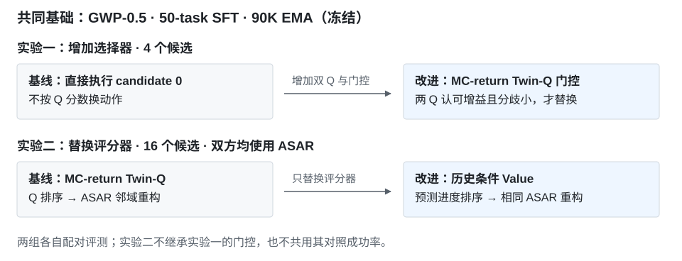

# GWP：叠三碗的价值引导控制

[首页](../../README.md) · [基础策略](../gwp-baselines/README.md) · [门控实验](experiments/mc-return-q-gate.md) · [Value 实验](experiments/world-value-asar.md)

## 基础策略与实验目的

基础策略是 **GigaWorldPolicy-0.5 的 RoboTwin 50-task SFT，step 90K EMA**，使用三视角图像、任务指令与双臂 EEF 状态。SFT 数据共 27,500 条示范；每次规划 48 步动作，执行前 12 步后重新观察。

本项目测试：在基础策略不再训练的情况下，能否利用它预测的未来画面，选出更容易完成叠碗的动作。评价器在离线数据上训练，评测期间所有参数冻结。

环境采用固定桌面与光照，保留布局、杂物变化。下列两项分别做配对实验，每组 8 个未参与评价器训练的布局，每布局采样 4 次。

## 增加双 Q 门控：减少错误动作替换

基线直接执行 GWP 生成的 **candidate 0（第一个候选）**，不根据 Q 分数换动作，也不做邻域重构。

改进方法从成功与失败轨迹计算 Monte-Carlo 折扣回报，训练两个 Q 网络评价“当前观察、候选动作、预测未来、机器人状态”。生成 4 个候选后，只有两个 Q 都判断某候选优于 candidate 0，且分歧较小时，才替换原动作。门控用于限制评价器判断错误时的干预。

| 执行方法 | 成功数 | 成功率 |
| --- | ---: | ---: |
| 基线：SFT 直接执行 candidate 0 | 26/32 | 81.25% |
| 改进：同一 SFT＋MC-return Twin-Q 门控 | **28/32** | **87.50%** |

净增 2 次成功：3 次由失败变成功，1 次由成功变失败。

[网络结构、回报目标、门控条件与配对记录 →](experiments/mc-return-q-gate.md)

## 替换评分器：为 ASAR 提供历史进度信息

ASAR 在高分候选的局部邻域内加权重构动作，用于降低单个候选的噪声；效果依赖候选排序。本组固定 **16 个候选＋相同 ASAR 控制器**，只替换评分器，检验历史与进度监督是否改善控制结果。

基线使用前述 MC-return Twin-Q。新评分器读取最近 5 步视觉与状态，预测带失败惩罚的剩余时间进度；用真实后继和世界模型预测后继共同训练，并约束两者的 Value 一致性。执行时按预测进度增量排序，再交给 ASAR。

| ASAR 的评分器 | 成功数 | 成功率 |
| --- | ---: | ---: |
| 基线：MC-return Twin-Q | 23/32 | 71.88% |
| 改进：5 步历史条件 Value | **27/32** | **84.38%** |

净增 4 次成功。这里的 23/32 是 **Q＋ASAR**，不是原始 SFT；该组也没有在 Q-gate 上继续叠加模块。

[历史网络、进度标签、ASAR 算法与配对记录 →](experiments/world-value-asar.md)

## 两组实验的关系

随机化五任务测试里的叠碗 SFT 为 20/32，使用另一套场景协议，不能与这里的 28/32 相减。[SFT 训练配方与各组基线](../gwp-baselines/README.md)

## 其他实验

另在摆双鞋任务做了 Q 奖励下的 ActionExpert LoRA 策略更新，SFT 35/64、LoRA 36/64，动作漂移超过预设门限。[策略参数更新实验](experiments/action-expert-lora.md)

Q-gate 的扩展 24 对持平；Value＋ASAR 仍有 5 对由成功变失败。持续重构可能放大错误排序，原因尚未通过独立消融确认。两组叠碗收益均为小样本观察，尚未达到统计显著性。
