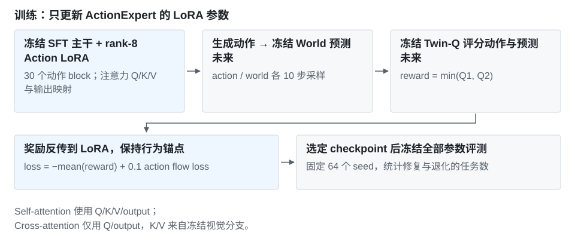

# ActionExpert LoRA：方法与实验记录

[项目介绍](../README.md) · [正式评测](../../../data/experiments/gwp-stage-f-evals.json)

## 实验目的与基线

检验冻结 World / Twin-Q 提供的奖励能否用于更新动作策略，同时用 action flow-matching 约束保留 SFT 行为。这里的目标是训练更好的策略参数，评测任务为 RoboTwin 摆双鞋（place_dual_shoes）。

| 比较项 | 基线 | 改进方法 |
| --- | --- | --- |
| 初始策略 | GWP-0.5，50-task SFT，90K EMA | 相同初始化 |
| 参数更新 | 不追加训练 | 仅训练 ActionExpert rank-8 LoRA |
| 训练目标 | 已完成的 SFT | 冻结 Q 奖励＋action flow-matching 锚点 |
| 同一组 64 seeds | 35/64 | 36/64 |

该组与叠碗的 Q-gate / ASAR 评测独立；使用的是 Stage-B Twin-Q，不是叠碗 no_interactions_lambda1 评价器。

## 方法



冻结 VisualExpert、VAE、状态/动作输入映射、动作 decoder、World 和 Twin-Q。只在 30 个 ActionExpert block 的 self-attention Q/K/V/output 及 cross-attention Q/output 上加 LoRA。

```text
当前观察 / state / 指令 / action noise
    → SFT ActionExpert + LoRA → 候选动作
    → 冻结 World 预测未来 → 冻结 Twin-Q 评分

loss = −mean(min(Q1, Q2)) + 0.1 × action flow-matching loss
```

Q 奖励鼓励高分动作，原始 action flow-matching 在同一 demo＋rollout replay 上约束行为漂移。LoRA 的 rank/alpha=8/8，dropout=0，活跃参数为 5,898,240。

| 配置 | 值 |
| --- | --- |
| 初始策略 | 50-task SFT step 90000 EMA |
| 固定 World / Twin-Q | Stage-A step 3000 EMA / Stage-B step 6000 |
| optimizer / lr / grad clip | AdamW / 2e-5 / 0.5 |
| GPUs / batch / 累积 | 4 / 每卡 1 / 4；有效 batch 16 |
| 训练 / 选中 step | 300 / 150 |
| action / world sampling | 10 / 10 步 |
| 规划 / 执行长度 | 48 / 12 |

## 评测记录

| 对照 | 成功数 | 同 seed 比较 |
| --- | ---: | --- |
| SFT | 35/64 | 对照独赢 9 次 |
| ActionExpert LoRA | 36/64 | 方法独赢 10 次 |

两版使用相同 64 个 seed；净增 1 次，精确配对检验 p=1.0。正式摘要的完成数、预期数与 worker 汇总一致。

## 简要失败分析

64-state 审计中 Q gain 为 +0.004181，但动作相对漂移为 6.44%，超过预设 3% 门限。10 次修复被 9 次退化抵消，较大的更新范围没有带来稳定任务收益。

[两版评测与 worker 汇总](../../../data/experiments/gwp-stage-f-evals.json) · [来源哈希](../../../data/experiments/manifest.json)
