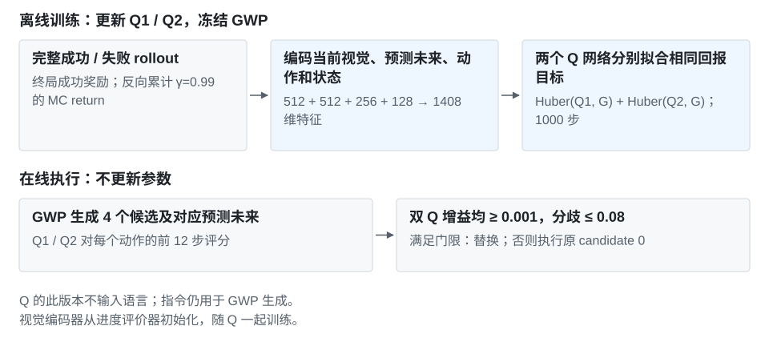

# MC-return Twin-Q：方法与实验记录

[项目介绍](../README.md) · [逐次配对 CSV](../../../data/experiments/gwp-qgate-paired.csv) · [训练指标](../../../data/experiments/gwp-mc-q-training.csv)

## 实验目的与基线

验证双 Q 的保守动作选择能否提高原始 SFT 策略的叠碗成功率，并通过回退门控控制错误干预。

**基础策略：GigaWorldPolicy-0.5，RoboTwin 50-task SFT，step 90K EMA。** 评测任务为叠三碗（stack_bowls_three）；固定桌面与光照，改变物体布局及杂物。规划 48 步，执行 12 步再重规划。

| 比较项 | 基线 | 改进方法 |
| --- | --- | --- |
| 策略 / 世界模型权重 | 90K EMA，冻结 | 相同权重，冻结 |
| 候选生成 | 4 个，10 步 flow sampling | 相同设置 |
| 实际执行 | 直接用 candidate 0，不调用评价器换动作 | 双 Q 排序，通过门控才替换 candidate 0 |
| 配对结果 | 26/32（81.25%） | **28/32（87.50%）** |

两臂使用相同配对场景和采样设置。只比较是否增加 Q 选择与回退；不是重训一版 GWP。数据为 8 个 held-out 布局各采样 4 次，共 32 对。

## 方法定义



### 网络输入与结构

每个 Q 接收当前视觉 latent、候选动作的预测未来 latent、前 12 步动作与当前双臂 EEF 状态。视觉编码器由进度评价器初始化，和 Q 一起训练；此版 Q 不读取语言，也没有 latent 差分或乘积交互特征。指令仍用于 GWP 生成候选。

| 分支 | 编码方法 | 输出维度 |
| --- | --- | ---: |
| 当前视觉 / 预测未来 | 共享 Conv + ResBlock 视觉编码器；两次编码 | 512 + 512 |
| 候选动作 | 12×16 动作，3 层 Transformer，8 heads，CLS 汇聚 | 256 |
| 当前状态 | 16-D EEF → MLP | 128 |
| 融合与回归 | 拼接 1408 维 → MLP 2048 → 512 → 1 | 标量 Q |

Q1、Q2 是独立参数网络。共训练 32,074,882 个参数，不更新 GWP 的策略或世界模型。

### 训练目标

使用完整 rollout 的终局成功奖励。对每条轨迹从后向前计算 Monte-Carlo return：

```text
G_t = r_t + 0.99 × (1 − done_t) × G_(t+1)
loss = Huber(Q1(s_t, a_t, z_future), G_t)
     + Huber(Q2(s_t, a_t, z_future), G_t)
```

成功终局奖励为 1，失败为 0。实跑使用 lambda-return 的 λ=1 端点，目标就是 MC return，不再混入一步 TD bootstrap。训练/验证共 9770 条 transition，按布局隔离为 8049 / 1721 条。

| 参数 | 值 |
| --- | --- |
| 实验配置名 | no_interactions_lambda1 |
| optimizer / lr / weight decay | AdamW / 5e-5 / 1e-4 |
| batch / steps / grad clip | 64 / 1000 / 1.0 |
| gamma / lambda-return | 0.99 / 1.0 |
| seed / 验证间隔 | 20260804 / 20 steps，另含 step 1 |

[配置与最终指标](../../../data/experiments/gwp-mc-q-config.json) · [51 个训练/验证记录点](../../../data/experiments/gwp-mc-q-training.csv)

### 从评分到执行

GWP 以 10 步 flow sampling 生成 4 个候选，并预测对应未来。用 min(Q1,Q2) 选候选，但只有两 head 相对 candidate 0 的增益都不少于 0.001，且候选处 Q 分歧不超过 0.08 时才覆盖；否则执行 candidate 0。每次执行 12 步后重新观察和规划。

## 评测记录

首个正式配对的当前 latent、state、动作、未来 latent 与 Q 一致性检查通过。初测与扩展分别如下：

| 阶段 | 无选择器 GWP | MC-return Q-gate | 方法独赢 / 对照独赢 |
| --- | ---: | ---: | --- |
| 初始 8 对 | 5/8 | 7/8 | 2 / 0 |
| 扩展 24 对 | 21/24 | 21/24 | 1 / 1 |
| 合计 | **26/32** | **28/32** | **3 / 1** |

扩展阶段在 1130 次重规划中覆盖原动作 216 次（19.12%）。合计净增 2 次，但扩展 24 对持平；这是 8 个布局的重复采样，非 32 个独立布局。精确配对检验 p=0.625，无多训练种子重复。

## 简要失败分析

该门控仍出现 1 次对照成功、候选失败，说明双 Q 一致性不等于真实动作优势。另试过用同一个 Q 每步做 ASAR 邻域重构，32 对中成功 23 次；换成历史 Value 后为 27 次，详见[对应方法与独立实验](world-value-asar.md)。

数据字段 baseline_success / candidate_success 分别表示无选择器 GWP 与 MC-return Q-gate；repeat=0 为初测，1/2/3 为扩展。[来源哈希](../../../data/experiments/manifest.json)
