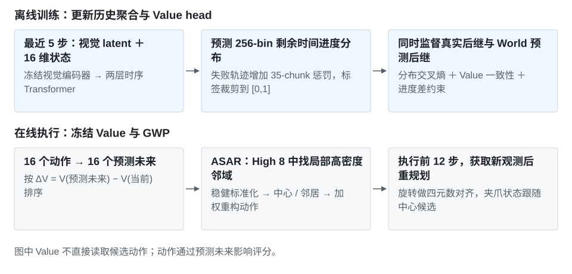
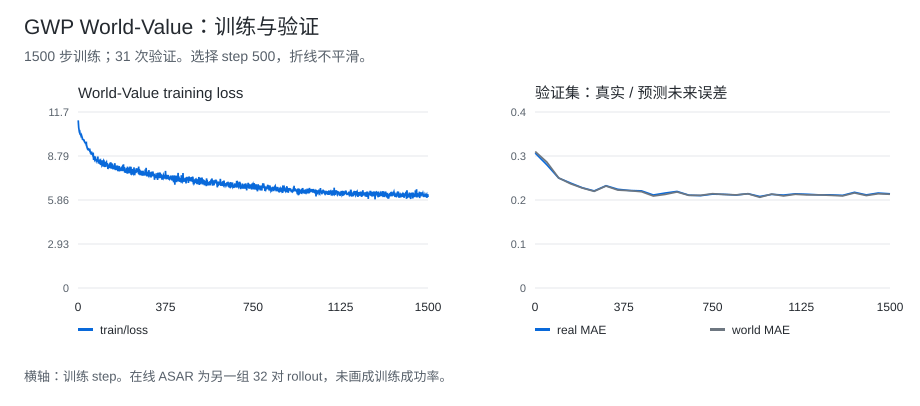

# 历史条件 Value＋ASAR：方法与实验记录

[项目介绍](../README.md) · [逐次配对 CSV](../../../data/experiments/gwp-asar-paired.csv) · [训练配置](../../../data/experiments/gwp-bowls-experiments.json)

## 实验目的与基线

检验历史条件与稠密进度监督能否改善 ASAR 的候选排序。MC-return Q 使用终局成败构造回报；本实验让 Value 学习轨迹各时刻的剩余时间进度，并对齐真实后继与预测后继的评分。

**基础策略：GigaWorldPolicy-0.5，RoboTwin 50-task SFT，step 90K EMA。** 任务为固定桌面与光照下的叠三碗，保留布局及杂物变化。两臂均冻结策略、世界模型和已训练的评价器。

| 比较项 | 基线 | 改进方法 |
| --- | --- | --- |
| 策略权重 | GWP 90K EMA | 相同权重 |
| 候选 / 采样 / 执行 | 16 个 / 10 步 flow / 执行前 12 步 | 相同设置 |
| 动作重构 | ASAR，高分 8 候选的局部邻域加权 | 相同控制器 |
| **仅改变评分器** | MC-return Twin-Q | 5 步历史条件 Value |
| 配对结果 | 23/32（71.88%） | **27/32（84.38%）** |

8 个布局各 4 对，共 32 对。23/32 的基线已经包含 Q＋ASAR，不是无选择器 SFT；此处的 +12.5 个百分点来自同一 ASAR 下的评分器替换。

## 方法定义



### 历史条件的分布 Value

视觉 latent 先经冻结的 550-demo 进度编码器映射为 512 维。16-D 机器人状态经 16→128→512 MLP 编码，与视觉、位置和有效位 embedding 相加；最近 5 步输入两层 Transformer，hidden=512、8 heads、FFN=2048，以 query token 汇聚历史。

模型输出 256-bin 的 [0,1] 分布，期望值为 Value。目标是剩余时间进度：

```text
y_t = clip(1 − (remaining_chunks + 35 × is_failure) / 100, 0, 1)
```

失败轨迹增加 35-chunk 惩罚。Value 不直接读取候选动作：动作先改变 World 的未来预测，再由 Value 评价预测未来。

### 训练目标

预计算当前、真实后继和 World 预测后继的视觉特征，只更新状态分支、历史聚合和 Value head。分布目标使用 HL-Gaussian cross-entropy，同时加入两种后继的一致性及进度差约束：

```text
loss = CE_now + 0.5 CE_real_next + 0.5 CE_world_next
     + 2 Huber(V_world, stopgrad(V_real))
     + 2 Huber(V_world − V_now, y_next − y_now)
```

数据来自 160 条固定背景、多布局 rollout，128 条训练、32 条未见布局验证。共 9770 条 transition，划分为 8049 / 1721 条。

| 配置 | 值 |
| --- | --- |
| optimizer / lr / weight decay | AdamW / 1e-4 / 1e-4 |
| batch / 训练 / 验证间隔 | 256 / 1500 steps / 50 steps，另含 step 1 |
| schedule / grad clip | cosine / 1.0 |
| 部署 checkpoint | 验证选中的 step 500 |

### ASAR 如何重构动作

1. GWP 生成 16 个、长度 48 的候选，使用共享视觉噪声预测各候选的未来。
2. 用第 12 步相对 EEF 动作近似组合下一状态，计算 ΔV=V(预测未来)−V(当前)，取 High 8。
3. 对 High 组前 12 步动作做 median/MAD 稳健标准化，以三个近邻平均距离找高密度中心，保留夹爪模式兼容的至多 5 个邻居。
4. 按动作距离和 Value 分数加权，重构动作；四元数符号对齐后归一化，夹爪跟随中心。最终动作为 90% 邻域结果＋10% top-1。
5. 执行前 12 步，重新观察。此版本每轮都重构，没有 Q-gate 式回退门限。

## 训练记录



[1500 步训练 CSV](../../../data/experiments/gwp-value-training.csv) · [31 次验证 CSV](../../../data/experiments/gwp-value-validation.csv)

选中 step 500 的真实状态 MAE 为 0.2113，预测未来 MAE 为 0.2091；World / real Value 相关系数为 0.9730。单步进度差相关系数只有 0.0458，较准确的整段进度不等于逐动作排序都可靠。

## 控制评测

两臂都使用 16 候选和相同 ASAR 重构，只替换评分器；这不是 Q-gate 那组 4 候选实验。8 个布局，每布局 4 对，共 32 对，无中止。首个配对中动作及预测未来张量的最大差值为 0。

| 方法 | 成功数 | 成功率 |
| --- | ---: | ---: |
| MC-return Twin-Q＋ASAR | 23/32 | 71.88% |
| 历史条件 Value＋ASAR | **27/32** | **84.38%** |

Value 方法独赢 9 对、双 Q 方法独赢 5 对、相同 18 对，精确双侧检验 p=0.424。结果为本次配对的 +12.5 个百分点，尚无多训练种子重复。

## 简要失败分析

MC-return 双 Q 配合每步 ASAR 只完成 23/32；错误排序在持续干预中被放大是待验证的解释。历史 Value 改善了整体结果，但仍有 5 对由成功变失败。训练用真实 state_next，推理用候选动作近似组合下一状态，而且重构动作未再送回 World 重评分，这两处误差尚未通过独立消融定位。

CSV 沿用原字段：old_q_success 对应 MC-return Twin-Q＋ASAR，world_value_success 对应历史条件 Value＋ASAR。[来源哈希](../../../data/experiments/manifest.json)
