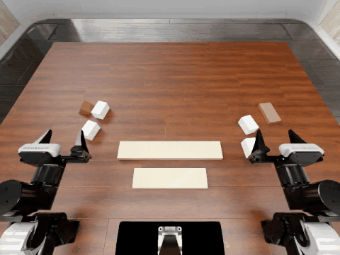

# GWP history memory

[首页](../../README.md) · [训练与消融记录](experiments/early-action-history.md)

为 GigaWorldPolicy 增加分层视觉历史，用当前观察检索过去的操作信息，并在动作分支早层注入。主干冻结，训练历史读取和门控残差模块。

## Results

| 任务 | SFT | Early-A | 阶段均分 |
| --- | ---: | ---: | --- |
| 倒瓶入桶 | 10/16 | **12/16** | 0.740625 → **0.831250** |
| 搭塔 | 0/16 | **2/16** | 0.050000 → **0.268750** |

每项 16 个布局。搭塔使用输出桥 OFF；checkpoint 经部分布局选择，并复用 SFT 基线。

## Method

在线 bank 保存最近 3 次重规划的完整视觉 token，把较早条目摘要后分层合并。当前观察查询历史，读出 8 个 512 维 token，通过门控残差注入 ActionExpert 第 4、8 层，视觉分支不注入。

训练按多尺度时间偏移取历史帧；推理端按真实执行顺序更新 bank。GWP 预测 48 步动作，每执行 12 步后结合新观察重新读取历史。

## Demo

搭塔 layout 4、10，Early-A，输出桥 OFF。约 4 倍速，末帧停留；成功标签来自环境评测。

## 中间实验

试过第 12/24 层双分支注入，搭塔没有完成；改为第 4/8 层仅动作注入后出现成功案例。另加右臂输出桥，开启时为 1/16，关闭时为 2/16，因此保留仅 Early-A 的展示结果。

[具体配置、位置消融和门控对照](experiments/early-action-history.md) · [逐布局记录](../../data/experiments/memory-episodes.csv) · [视频说明](../../docs/video-cases.md)
