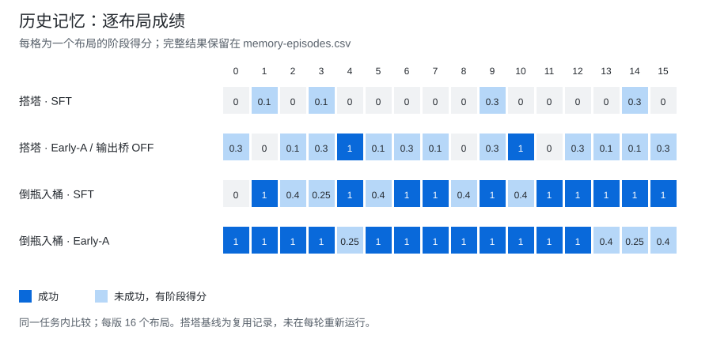
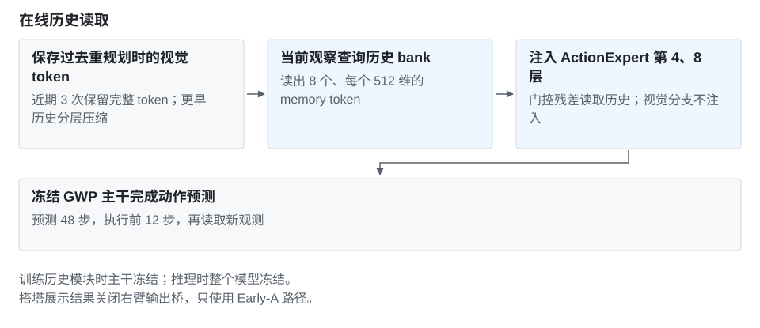

# Early-A：训练配置与消融记录

[项目介绍](../README.md)

为 GigaWorldPolicy 的动作分支加入历史视觉信息。主干冻结，当前观察查询历史 bank，得到 8 个 memory token，在第 4、8 层通过残差模块注入。视频分支保持原样。

[首页](../../../README.md) · [结果](#results) · [方法](#method) · [配置](#训练配置) · [案例视频](../README.md#demo) · [逐布局 CSV](../../../data/experiments/memory-episodes.csv)

## Results

| 任务 | SFT | 历史记忆 | 成功率变化 | 阶段均分变化 |
| --- | --- | --- | --- | --- |
| 倒瓶入桶 | 10/16（62.5%） | **12/16（75.0%）** | **+12.5 个百分点** | 0.740625 → **0.831250**（+0.090625） |
| 搭塔 | 0/16（0%） | **2/16（12.5%）** | **+12.5 个百分点** | 0.050000 → **0.268750**（+0.218750） |

两项对照各 16 个布局。阶段得分是环境 score，不等同于整任务成功率。

### 评测设置

每版 16 个布局，seed group 2，预测 48 步、执行 12 步后重规划。倒瓶入桶使用任务对应的 step 3000；搭塔使用 V2 step 500，`history_gate=1`、`output_gate=0`。

搭塔的 V2 只训练右臂输出桥；评测关闭该桥后，生效的是冻结的 Early-A 4/8 路径。因此 **2/16 不属于输出桥的收益**。该 checkpoint 先在 8 个布局上选点，再测包含这些布局的 16 个布局，并复用原 SFT 基线。两项结果均未做多训练种子重复。

## Method

在线 bank 保留最近 3 次重规划的完整视觉 token；较早条目先摘要，再分层合并。每次重规划由当前观察查询历史，读出的 token 注入动作分支。

训练使用历史帧偏移 `[-192, -96, -48, -24, -12]`，`history_recent_count=2`。在线 bank 的 `recent_capacity=3` 控制推理时保留的完整条目数，与训练采样参数分别设置。

### 训练配置

| 参数 | 倒瓶入桶 Early-A | 搭塔 V2 / 输出桥 OFF |
| --- | --- | --- |
| 配置 ID | `memory-dustbin-config` | `memory-v2-config` |
| 原始 SFT checkpoint | 35-task SFT，step 50000 | 同一 SFT 主干 |
| 历史模块 | Snapshot history，动作 4/8 层 | 冻结 Early-A，动作 4/8 层 |
| Memory | 8 tokens，dim 512 | 8 tokens，dim 512 |
| 学习率 / 精度 | 1e-4 / BF16 | 1e-4 / BF16 |
| 可训练模块 | 历史模块 | 右臂输出桥；评测时关闭 |
| 训练 / 选用 step | 3000 / 3000 | 1500 / 500 |
| 有效 batch | 1 GPU × 1 × 累积 16 = 16 | 4 GPUs × 1 × 累积 4 = 16 |
| Run ID | `put_bottles_into_dustbin-early-a` | `tower-v2-output-off` |

[完整配置摘录](../../../data/experiments/memory-configs.json)包含优化器、训练 episode 范围及其他开关。当前仓库不含训练入口。

## 中间实验

只保留与注入位置和输出桥有关的对照。完整运行结果可按需展开。

展开注入位置与门控对照

| 版本 | 成功 / 16 | 平均阶段得分 | 观察 |
| --- | ---: | ---: | --- |
| 12/24 层双分支，初测 | 0 | 0.0125 | 低于 SFT 的 0.05 |
| 12/24 层双分支，复测 | 0 | 0.03125 | 残差改变动作，结果仍无提升 |
| 12/24 层，gate=0 | 0 | 0.0375 | 同输入、同噪声检查中动作差值为 0 |
| 4/8 层，仅动作分支 | 1 | 0.2125 | layout 0 成功 |
| 4/8 层，视频与动作分支 | 0 | 0.0750 | 低于仅动作分支 |
| V2 右臂输出桥 ON | 1 | 0.16875 | 同 checkpoint 的 OFF 为 2/16、0.26875 |

gate=0 的单次前向一致性不代表闭环轨迹一致。早期 Early-A 的 1/16 与后续输出桥 OFF 的 2/16 来自不同运行；尚未定位两轮差异的原因。

Token 数量消融与其他任务

4 / 8 / 16 / 32 token 重训均为 0/16，平均得分依次为 0.0500、0.0625、0.0500、0.04375；8-token 重训未复现此前收益，原因未定位。

六个扩展任务中，倒瓶入桶为 10/16 → 12/16，传送带抓取为 2/16 → 1/16，其余四个任务仍为 0/16。[全部运行](../../../data/experiments/memory-runs.json) · [失败原因简表](../../../docs/failed-experiments.md)

## Experiment files

| 文件 | 内容 |
| --- | --- |
| [memory-runs.json](../../../data/experiments/memory-runs.json) | 24 组评测，含 run ID、基线引用、checkpoint 与开关 |
| [memory-episodes.csv](../../../data/experiments/memory-episodes.csv) | 384 条布局结果：success、score、环境步数 |
| [memory-configs.json](../../../data/experiments/memory-configs.json) | 9 份训练配置摘录 |
| [memory-zero-gate-audit.json](../../../data/experiments/memory-zero-gate-audit.json) | 门控关闭时的前向一致性检查 |

搭塔基线只存一次，各版本通过 `baseline_run_id` 引用。[文件哈希](../../../data/experiments/manifest.json) · [评测口径](../../../docs/evaluation-protocol.md)
