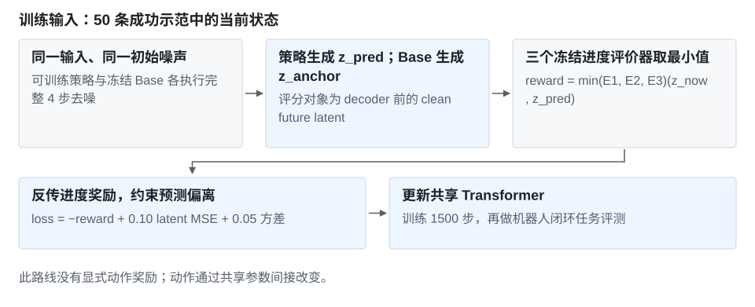
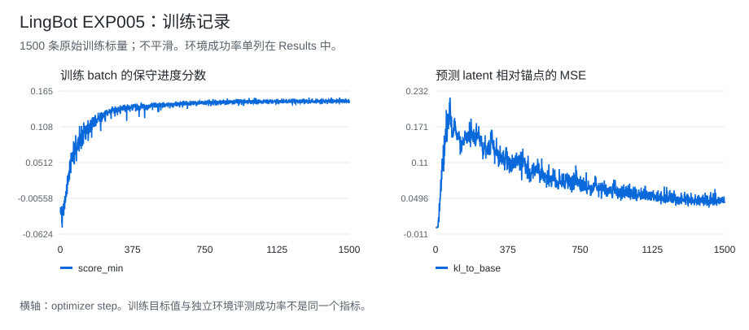

# LingBot Exp005：完整去噪链路上的进度 RL

[首页](../../../README.md) · [LingBot 实验总表](../README.md) · [训练 CSV](../../../data/experiments/lingbot-exp005-training.csv) · [正式评测](../../../data/experiments/lingbot-formal-evals.json)

## 结果

任务 `place_bread_basket`，Exp005 为 **11/16（68.75%）**，相对历史报告的原始 Base 9/16 增加 2 次成功、12.5 个百分点。另一个 Raw SFT step 400 对照也是 11/16，因此这项结果是相对 Base 的收益，不是超过 SFT。

| 对照 | 成功数 | 成功率 | 记录来源 |
| --- | ---: | ---: | --- |
| 原始 Base | 9/16 | 56.25% | 历史实验报告引用，未补到逐 seed 原文件 |
| Exp005 step 1500 | **11/16** | **68.75%** | 正式汇总，worker 为 2/4、2/4、4/4、3/4 |
| Raw SFT step 400 | 11/16 | 68.75% | 视频审阅集的逐 seed 记录 |

Exp005 的正式评测完成 16 次、预期 16 次，与审阅集总数一致。Base 比较是报告级对照；没有多训练种子重复。

## 做了什么

目标是让模型生成的未来 latent 获得更高进度评分。训练输入只使用示范中的当前状态；真实未来帧不作为这条奖励路径的 MSE 目标。



```text
loss = -min(E1, E2, E3)(z_now, z_pred)
       + 0.10 * MSE(z_pred, stopgrad(z_anchor))
       + 0.05 * variance(E1, E2, E3)
```

与 Exp003 的单步 x0 估计不同，Exp005 评分的是完整 scheduler 输出、进入 decoder 前的 clean latent，梯度经过全部 4 步去噪。日志里的 `kl_to_base` 实际是 latent MSE，不是解析 KL。该版本没有显式 action loss。

## 实验记录



| Step | score_min | latent MSE | grad norm |
| --- | ---: | ---: | ---: |
| 1 | -0.028881 | 0.000000 | 1.877423 |
| 500 | 0.143786 | 0.101801 | 0.110199 |
| 1000 | 0.147743 | 0.051076 | 0.043412 |
| 1500 | 0.149629 | 0.044562 | 0.072902 |

这里是训练 batch 指标，不是环境成功率。全部 **1500 行**保存在 [CSV](../../../data/experiments/lingbot-exp005-training.csv)，图表由该文件生成。

| 配置 | 值 |
| --- | --- |
| 初始模型 / 锚点 | 原始 Base，非 Raw SFT step 400 |
| 数据 | 50 条成功示范的 366 个当前状态 |
| 去噪 / CFG | 4 步 / 1.0 |
| 学习率 / 训练步数 | 1e-5 / 1500 |
| Batch | 2/GPU × 4 GPUs × 累积 4 = 32 |
| 评分 | 3 个冻结评价器，保守最小值 |

[配置摘录](../../../data/experiments/lingbot-selected-configs.json) · [文件哈希](../../../data/experiments/manifest.json) · [同 seed 视频案例](../../../docs/video-cases.md#lingbot-的一个改善案例)

## 失败与后续实验

| 版本 | 结果 | 原因或观察 |
| --- | --- | --- |
| Exp007 | 8/16 | 25 步前向、末 4 步反传；闭环进度评分部分变好，但任务成功数下降。不能把评分提高等同于动作变好。 |
| Exp012 | 2/16 | 将原目标直接放到 Raw SFT 上训练出现退化；共享参数变化破坏动作能力是待验证解释。 |

后续分别测试了[候选偏好与 loser 梯度保护](exp010-preference.md)、[限制更新范围的 LoRA](exp016-lora.md)。它们的比较对象和成功率在各自页面单列。
