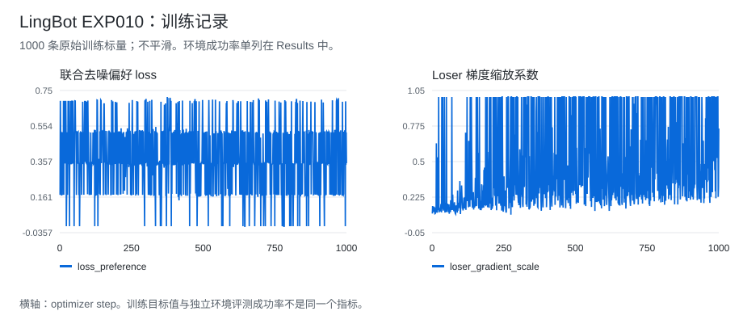

# LingBot Exp010：候选偏好训练的 loser 梯度保护

[首页](../../../README.md) · [LingBot 实验总表](../README.md) · [训练 CSV](../../../data/experiments/lingbot-exp010-training.csv) · [正式评测](../../../data/experiments/lingbot-formal-evals.json)

## 结果

加入 loser 梯度保护后，成功率从 Exp009 的 **25.0% 提高到 37.5%（4/16 → 6/16，+12.5 个百分点）**。这是偏好训练内部的改善，仍低于 Raw SFT 的 11/16。

| 版本 | 改动 | 成功率 |
| --- | --- | ---: |
| Raw SFT | 无偏好更新 | 68.75%（11/16） |
| Exp009 | 同状态 K2 候选，参考模型相对偏好 | 25.00%（4/16） |
| Exp010 | 对 loser 分支的梯度增加保护 | **37.50%（6/16）** |

Exp010 正式评测完成 16/16；Exp009 的计数来自同一审阅集的逐 seed 表。训练从 Raw SFT 重新初始化，不继承 Exp009 的权重。

## 做了什么

Exp008 直接提高评价器分数后，环境成功数下降。Exp009 改为只用评价器给同状态的两个候选排序，不对评分器反传。

```text
当前状态 → 策略生成 K=2 个 video/action 候选
                       ↓
          三个评价器一致同意排序时接收该对
                       ↓
          与冻结 SFT 比较联合去噪误差，计算偏好 loss
                       ↓
      Exp010：按输出梯度方向缩放 loser 分支的反向贡献
```

Exp009 的相对偏好差值可能通过增大 loser 的去噪误差改善。当 winner 与 loser 的输出梯度同向时，这种更新也可能损伤 winner。Exp010 保留候选、排序和参考模型，只调整 loser 的反向贡献，保护系数 `mu=0.9`。

## 实验记录



| Step | Preference loss | Loser gradient scale | Current winner MSE | Reference winner MSE |
| --- | ---: | ---: | ---: | ---: |
| 1 | 0.173287 | 0.098162 | 0.238318 | 0.238318 |
| 500 | 0.342284 | 1.000000 | 0.161822 | 0.344581 |
| 1000 | 0.348569 | 0.755630 | 0.114119 | 0.272332 |

scale 不是固定值。上表为单个训练 batch，完整 **1000 行**包含接受对比例、梯度夹角、候选距离、参考与当前误差，见 [CSV](../../../data/experiments/lingbot-exp010-training.csv)。

| 配置 | 值 |
| --- | --- |
| 初始化 / 冻结参考 | Raw SFT step 400 |
| 候选数 / 深度 | 2 / 1 |
| 视频采样 | 25 步，CFG 5 |
| 动作采样 | 50 步，CFG 1 |
| 训练目标 | Reference-relative joint video/action denoising preference |
| Beta / mu | 1.0 / 0.9 |
| 学习率 / Steps | 1e-6 / 1000 |
| Batch | 2/GPU × 4 GPUs，累积 1 |

[配置摘录](../../../data/experiments/lingbot-selected-configs.json) · [逐 seed 对照](../../../data/experiments/lingbot-episodes.csv) · [文件哈希](../../../data/experiments/manifest.json)

## 失败与后续实验

| 问题 | 证据与解释 |
| --- | --- |
| Exp009 的相对偏好目标出现退化 | 日志记录 video/action MSE 对参考模型的偏离上升；提高相对差值不保证两个候选本身更好。 |
| Exp010 仍未超过 SFT | 6/16 对 11/16。梯度保护缓解了该优化现象，但没有验证评价器偏好的未来一定能被动作执行出来。 |

“动作可实现性不足”是日志中的工作解释，不是已完成因果消融的结论。[完整 RL 路线索引](../../../docs/rl-experiment-index.md)
