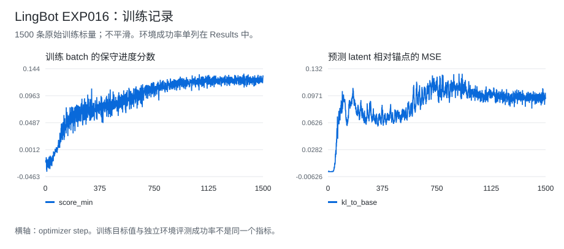

# LingBot Exp016：用后层 LoRA 缓解进度 RL 退化

[首页](../../../README.md) · [LingBot 实验总表](../README.md) · [训练 CSV](../../../data/experiments/lingbot-exp016-training.csv) · [正式评测](../../../data/experiments/lingbot-formal-evals.json)

## 结果

成功率从全参数进度 RL（Exp012）的 **12.5% 恢复到 62.5%（2/16 → 10/16，+50 个百分点）**，仍低于 Raw SFT 的 68.75%。这里展示的是减轻后训练退化，不是超过 SFT。

| 版本 | 更新范围 | 成功率 |
| --- | --- | ---: |
| Raw SFT | 不做额外进度 RL | 68.75%（11/16） |
| Exp012 | 全参数进度 RL，lr 1e-5 | 12.50%（2/16） |
| Exp016 | 后 4 个共享 block 的 LoRA，lr 1e-4 | **62.50%（10/16）** |

Exp016 正式摘要的四个 worker 为 **3/4、1/4、4/4、2/4**，完成数与预期数均为 16。旧报告曾显示“schema not recognized”；正式摘要可以确认结果，不再把它记为未知。

这组比较同时改变了参数更新范围和学习率，不能把全部恢复幅度仅归因于 LoRA 结构。没有多训练种子重复。

## 做了什么

Exp005 从原始 Base 训练得到 11/16；同一进度目标直接接在 Raw SFT 上的 Exp012 只有 2/16。Exp016 保留进度目标和完整 4 步去噪，冻结原始 SFT 参数，只训练共享 blocks 26–29 中 Linear 模块的 LoRA。

```text
W_effective = W_sft + (alpha / rank) * B @ A
rank = 8, alpha = 8
B 初始化为 0，初始策略与 SFT 一致

loss = -score_min + 0.10 * latent_MSE_to_SFT + 0.05 * disagreement
```

共 40 个目标模块、**2,686,976 个可训练参数**。保存 checkpoint 时将 LoRA 合并进原权重，推理接口不增加外置 adapter。此处是实现与配置说明；本仓库不含模型权重。

## 实验记录



| Step | score_min | latent MSE | grad norm |
| --- | ---: | ---: | ---: |
| 1 | -0.020106 | 0.000000 | 0.009662 |
| 500 | 0.079824 | 0.068044 | 0.191578 |
| 1000 | 0.123787 | 0.095497 | 0.147250 |
| 1500 | 0.132018 | 0.094649 | 0.498886 |

全部 **1500 行**训练标量见 [CSV](../../../data/experiments/lingbot-exp016-training.csv)。训练分数不是任务成功率；终点 latent MSE 也没有直接给出动作稳定性。

| 配置 | 值 |
| --- | --- |
| 数据 / 初始模型 | 同一 366 条当前状态 / Raw SFT step 400 |
| 训练范围 | blocks 26–29，40 个 Linear 模块 |
| LoRA rank / alpha / dropout | 8 / 8 / 0 |
| 去噪 / CFG | 4 步 / 1.0 |
| 学习率 / Steps | 1e-4 / 1500 |
| Batch | 2/GPU × 4 GPUs × 累积 4 = 32 |

[完整模块列表与配置摘录](../../../data/experiments/lingbot-selected-configs.json) · [4-worker 正式结果](../../../data/experiments/lingbot-formal-evals.json) · [文件哈希](../../../data/experiments/manifest.json)

## 失败与后续实验

| 版本 / 问题 | 结果 | 原因或观察 |
| --- | --- | --- |
| Exp012 全参数更新 | 2/16 | 原进度目标放在 SFT 上出现明显退化；共享表示受损是待验证解释。 |
| Exp016 仍低于 SFT | 10/16 对 11/16 | 限制更新范围后退化减轻，但未证明奖励与动作成功充分对齐；仍需重复评测与动作审计。 |

[全部实验与记录范围](../../../docs/rl-experiment-index.md)
