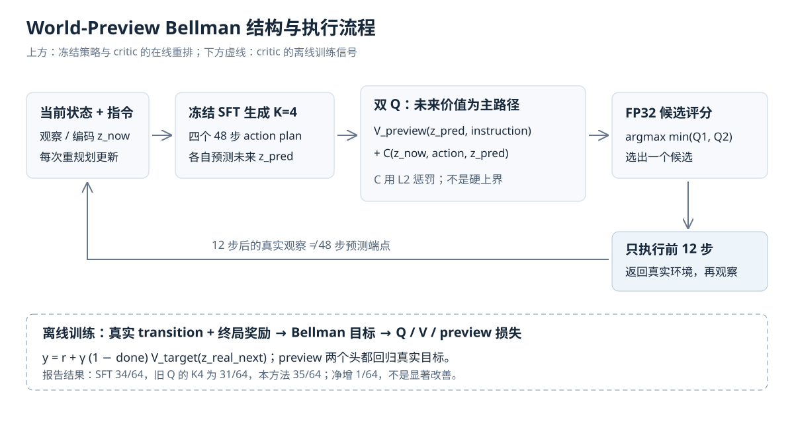
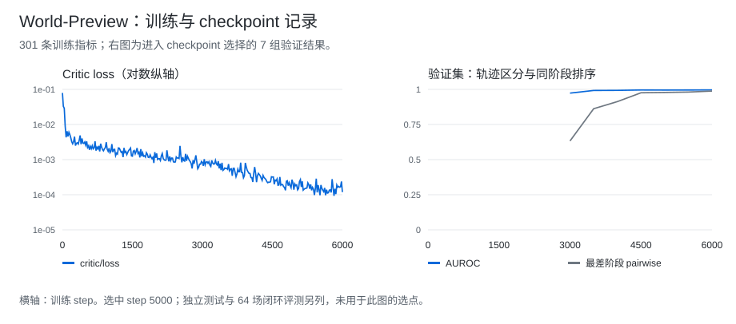
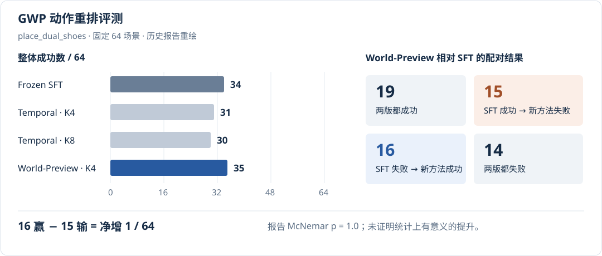

# GWP：世界预测与动作选择

[首页](../../README.md) · [64 场配对结果](../../data/experiments/gwp-paired.csv) · [训练指标](../../data/experiments/gwp-training.csv) · [checkpoint 评测](../../data/experiments/gwp-checkpoints.csv)

冻结 GWP 的 SFT 策略，用预测未来 latent 和双 Q 评价器对候选动作重排。任务为 `place_dual_shoes`，每次从 K 个候选中选择 `min(Q1, Q2)` 最大的动作。K4 的环境评测为 35/64，SFT 为 34/64，配对结果未显示稳定收益。

## World-Preview Bellman



```text
Q(z_now, action, z_pred) = V_preview(z_pred, instruction)
                          + C(z_now, action, z_pred, instruction)
target = reward + gamma * (1 - done) * V_target(z_real_next)
```

预测未来 latent 提供主评分，当前状态、动作与未来进入残差项 C，残差加 L2 正则。两个 head 仍使用真实后继状态构造 Bellman 目标。每个候选预测 48 步，实际只执行 12 步，然后重新规划。

gamma=0.98、expectile=0.7、target EMA=0.005、残差 L2 系数 0.1，学习率 1e-4，训练 6000 steps。这些参数来自运行报告；完整训练配置和源码不在仓库中。

## 训练与选点



`metrics.jsonl` 共 301 条记录，step 1 到 6000。选点清单包含 7 个 eligible checkpoints，step 5000 由 validation 选出。

| Step 5000 指标 | Validation | Test |
| --- | ---: | ---: |
| 轨迹 outcome AUROC | 0.995130 | 0.9391 |
| 同阶段 pairwise 最小值 | 0.978144 | 0.6309 |
| Preview-only AUROC | 0.995097 | 0.9385 |
| 移除 future 后 AUROC | 0.963950 | 0.9275 |

[checkpoint 指标](../../data/experiments/gwp-checkpoints.csv)包括 7 行 validation，以及选中 step 5000 后的 1 行 test。Test 不参与选点。

## 64 场环境评测

SFT 成功率 **53.125%**，World-Preview K4 为 **54.6875%**，相差 **1.5625 个百分点（34/64 → 35/64）**。这组配对评测未显示稳定收益。



| 配对情况 | 场景数 |
| --- | ---: |
| 两版都成功 | 19 |
| 仅 SFT 成功 | 15 |
| 仅 World-Preview 成功 | 16 |
| 两版都失败 | 14 |

两版相互替换了 31 个场景的成败，净增 1 次成功。精确 McNemar 双侧 p=1.0。[逐场景配对 CSV](../../data/experiments/gwp-paired.csv)

Temporal twin-Q 的 K4/K8 为 31/64、30/64，仅有报告汇总，缺少对应逐 episode 文件。

## 未采用的数据与诊断

| 项目 | 记录 |
| --- | --- |
| 真实分支偏好 | 8 个源状态、32 条分支；5 组通过审查，仅 1 个混合组、4 个偏好对 |
| 拒绝原因 | 12 条分支未通过重放审查；validation/test 有效组均为 0 |
| 候选精度 | 报告记录 BF16 将小分差量化为并列；FP32 smoke 为 4/4，但四对来自同一状态组 |
| 终局掉分 | 报告中 35 个成功 episode 有 12 个末次重规划掉分至少 0.10；未证明由时域差异造成 |

[分支接收阈值与计数](../../data/experiments/gwp-branch-gate.json) · [失败简表](../../docs/failed-experiments.md)

## 数据范围

数据文件包含训练标量、64 场配对成败、checkpoint 选点和 test 指标；不包含预测视频或原始环境轨迹。[数据来源与哈希](../../data/experiments/manifest.json)
